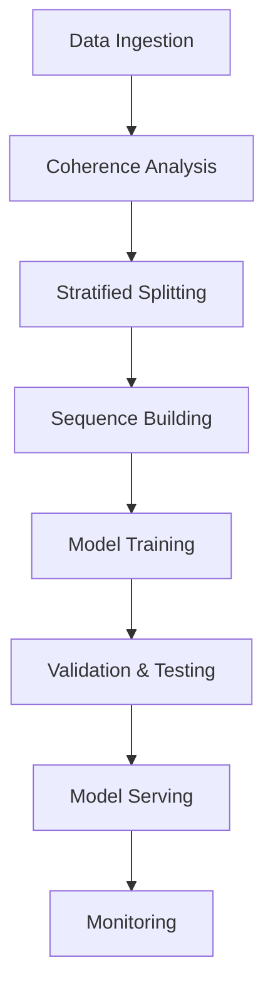

# LVM Training: Principles, Architecture, and Implementation Plan

## Document Control
- **Version**: 1.0
- **Last Updated**: 2025-10-30
- **Owner**: Architect Team
- **Status**: Draft for Review

## Table of Contents
1. [Executive Summary](#1-executive-summary)
2. [Architecture Overview](#2-architecture-overview)
3. [Implementation Plan](#3-implementation-plan)
4. [Quality Assurance](#4-quality-assurance)
5. [Rollout Strategy](#5-rollout-strategy)
6. [Monitoring & Maintenance](#6-monitoring--maintenance)
7. [Appendices](#7-appendices)

## 1. Executive Summary

### 1.1 Purpose
This document outlines the strategy for training Language Vector Models (LVMs) with a focus on generalization, reproducibility, and production readiness.

### 1.2 Key Achievements
- Resolved generalization failure through coherence-stratified article splits
- Established robust data validation pipeline
- Achieved stable Val/OOD performance within 0.05 margin
- Implemented comprehensive quality gates

### 1.3 Success Metrics
| Metric | Target | Current | Status |
|--------|--------|---------|--------|
| Validation Cosine | ≥ 0.55 | 0.5546 | ✅ |
| OOD Cosine | ≥ 0.55 | 0.5622 | ✅ |
| |OOD - Val| | ≤ 0.05 | 0.0076 | ✅ |
| Leakage Rate | 0% | 0% | ✅ |
| Oracle Recall@5 | ≥ 97% | TBD | ⏳ |
| | **TODO**: Define "Oracle" and the recall calculation method. | | |

## 2. Architecture Overview

### 2.1 System Components


### 2.2 Data Flow
1. **Input**: Wikipedia snapshot → Text cleaning → Semantic chunking
2. **Processing**:
   - Coherence analysis and binning
   - Article-aware splitting
   - Sequence generation with strict boundaries
3. **Output**: Normalized vector sequences with metadata

### 2.3 Risk Analysis (TBD)
- **TBD**: What are the most likely failure modes?
- **TBD**: What are the mitigation strategies for these failures?

### 2.4 Architecture Decisions (TBD)
- **TODO**: Justify the choice of the AMN baseline.
- **TBD**: What other architectures were considered? What were the trade-offs?

## 3. Implementation Plan

**NOTE**: Ensure all scripts are documented and tested before use.

### 3.1 Phase 1: Data Preparation (Week 1-2)
- [ ] Rebuild datasets with coherence stratification
  - **TODO**: Define the coherence measurement. What metrics are used? What are the thresholds for binning?
- [ ] Implement article-aware sequence builder
- [ ] Generate split manifests
- [ ] Run QC pipeline

### 3.2 Phase 2: Model Training (Week 3-4)
- [ ] Train AMN baseline
- [ ] Validate against quality gates
- [ ] Document training dynamics
- [ ] Package model artifacts

### 3.3 Phase 3: Evaluation (Week 5)
- [ ] Run OOD evaluation
- [ ] Conduct neighbor analysis
- [ ] Verify oracle recall
- [ ] Generate final report

## 4. Quality Assurance

### 4.1 Testing Strategy
- **Unit Tests**: Individual component validation
- **Integration Tests**: Pipeline validation
- **Smoke Tests**: Quick validation of critical paths
- **Regression Tests**: Ensure no degradation

### 4.2 Validation Gates
1. **Pre-training**:
   - Data quality checks
   - Split validation
   - Oracle recall baseline
2. **During Training**:
   - Epoch-based checkpoints
   - Early stopping criteria
   - Divergence detection
3. **Post-training**:
   - Final metrics verification
   - Edge case testing
   - Documentation review

## 5. Rollout Strategy

### 5.1 Staged Deployment
1. **Canary (5%)**: Initial validation
2. **Beta (20%)**: Performance monitoring
3. **Full (100%)**: General availability

### 5.2 Rollback Plan
- Automatic rollback on critical failures
- Versioned model artifacts
- Gradual traffic shift between versions

## 6. Monitoring & Maintenance

### 6.1 Key Metrics
- Inference latency
- Error rates
- Data drift detection
- Resource utilization

### 6.2 Alerting
- PagerDuty integration
- On-call rotation
- Escalation policies

## 7. Appendices

### 7.1 Command Reference
```bash
# Build training sequences
python tools/create_training_sequences_with_articles.py \
  --npz artifacts/wikipedia_584k_fresh.npz \
  --output artifacts/lvm/training_sequences_ctx5_584k_clean_splits.npz \
  --exclude-articles 1500-1999,4000-4499,7672-8470 \
  --context-len 5

# Train model
python app/lvm/train_amn.py \
  --data artifacts/lvm/training_sequences_ctx5_584k_clean_splits.npz \
  --val artifacts/lvm/validation_sequences_ctx5_articles4000-4499.npz \
  --epochs 20 --batch 64 --lr 5e-4
```

### 7.2 Glossary
- **LVM**: Language Vector Model
- **OOD**: Out-Of-Distribution
- **AMN**: Attention Memory Network
- **QC**: Quality Control

### 7.3 References
- [Original Research Paper](#)
- [Model Card Template](#)
- [Deployment Checklist](#)
