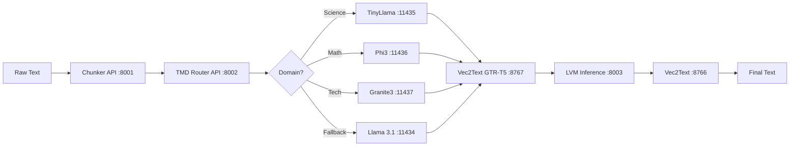

# PRD: FastAPI Services Architecture

**Document Version**: 1.1
**Date**: 2025-10-14 (Updated)
**Status**: Implementation In Progress
**Last Update**: Vec2Text server modernized with FastAPI lifespan pattern + quality analysis

---

## Overview

This document describes the FastAPI-based microservices architecture for LNSP (Latent Navigator Search Platform). Each service exposes RESTful endpoints for specific components of the TMD-LS (Tokenless Mamba Domain - Lane Specialist) pipeline.

---

## Service Architecture

```
┌─────────────────────────────────────────────────────────────────┐
│                     LNSP FastAPI Services                        │
├─────────────────────────────────────────────────────────────────┤
│                                                                   │
│  Text Processing Layer                                           │
│  ├─ Port 8900: Episode Chunker (Doc → Episodes)            [NEW]│
│  ├─ Port 8001: Semantic Chunker (Text → Text Chunks)            │
│  ├─ Port 8002: TMD Router API (Text → TMD Codes + Lane)         │
│  └─ Port 8004: Ingest API (Chunks → PostgreSQL + FAISS)         │
│                                                                   │
│  Embedding Layer                                                 │
│  ├─ Port 8767: Vec2Text-Compatible GTR-T5 Encoder (Text → 768D) │
│  │             (default for ingestion & training)               │
│  └─ Port 8766: Vec2Text Decoder (768D → Text)                   │
│                                                                   │
│  LLM Layer (Ollama-based)                                        │
│  ├─ Port 11434: Llama 3.1:8b (Fallback, Philosophy, Law)        │
│  ├─ Port 11435: TinyLlama (Science, Eng, History, Econ, Env)    │
│  ├─ Port 11436: Phi3 Mini (Math, Med, Art, Politics, Software)  │
│  └─ Port 11437: Granite3-MoE (Tech, Psych, Lit, Education)      │
│                                                                   │
│  LVM Layer                                                       │
│  └─ Port 8003: LVM Inference (768D+16D → 768D)            [TODO]│
│                                                                   │
└─────────────────────────────────────────────────────────────────┘
```

---

## ✅ Implemented Services

### 0. Episode Chunker API (Port 8900) [NEW - Oct 11, 2025]

**File**: `app/api/episode_chunker.py`
**Status**: ✅ Production Ready
**Purpose**: Converts long documents into coherent episodes based on semantic similarity

#### Endpoints

| Method | Endpoint | Description |
|--------|----------|-------------|
| POST | `/chunk` | Chunk document into coherent episodes |
| GET | `/health` | Health check |
| GET | `/` | Service info |

#### Request Schema
```json
{
  "document_id": "wikipedia_12345",
  "text": "Long document text...",
  "coherence_threshold": 0.6,
  "min_episode_length": 3,
  "max_episode_length": 20,
  "embedding_api": "http://localhost:8767"
}
```

#### Response Schema
```json
{
  "document_id": "wikipedia_12345",
  "episodes": [
    {
      "episode_id": "wikipedia_12345_ep0",
      "text": "Episode text...",
      "start_index": 0,
      "end_index": 5,
      "coherence_score": 0.78,
      "chunk_count": 6
    }
  ],
  "total_episodes": 5,
  "total_chunks": 30,
  "avg_coherence": 0.75
}
```

#### Performance Targets
- **Latency**: <2s per article (5KB-50KB)
- **Coherence Threshold**: 0.6 (detects topic shifts)
- **Throughput**: 30 articles/min

---

### 1. Semantic Chunker API (Port 8001)

**File**: `app/api/chunking.py`
**Status**: ✅ Production Ready

#### Purpose
Semantic text chunking for concept-based segmentation in TMD-LS pipeline.

#### Endpoints

| Method | Endpoint | Description |
|--------|----------|-------------|
| POST | `/chunk` | Chunk text using specified mode |
| GET | `/web` | Web UI interface |
| GET | `/health` | Health check |
| GET | `/stats` | Service statistics |

#### Request Schema
```json
{
  "text": "Your text content here...",
  "mode": "semantic",
  "max_chunk_size": 320,
  "model": "granite3-moe:1b",
  "similarity_threshold": 0.8,
  "overlap_sentences": 1
}
```

#### Response Schema
```json
{
  "chunks": [
    {
      "text": "Chunk content...",
      "start_idx": 0,
      "end_idx": 150,
      "metadata": {"concept_density": 0.85}
    }
  ],
  "metadata": {
    "mode": "semantic",
    "num_chunks": 5,
    "avg_chunk_size": 280,
    "processing_time_ms": 450
  }
}
```

#### Chunking Modes
- **Simple**: Fixed-size chunking (fast, deterministic)
- **Semantic**: Embedding-based similarity chunking (GPU-accelerated)
- **Proposition**: LLM-based atomic propositions (highest quality)
- **Hybrid**: Semantic + Proposition combined (balanced)

#### Multi-LLM Support
| Model | Port | Speed | Use Case |
|-------|------|-------|----------|
| Granite3-MoE | 11437 | 266ms | Production (fastest) |
| TinyLlama | 11435 | 716ms | Batch processing |
| Phi3 Mini | 11436 | 946ms | Precision tasks |
| Llama 3.1:8b | 11434 | 1614ms | Quality-critical |

#### Key Features
- 4 chunking modes with auto-fallback
- Multi-LLM routing with health checks
- Caching (LRU + similarity-based)
- Performance monitoring (20x speedup vs naive)
- Beautiful web UI at `/web`

#### Usage Example
```bash
curl -X POST http://localhost:8001/chunk \
  -H "Content-Type: application/json" \
  -d '{
    "text": "Photosynthesis is the process by which plants convert sunlight into chemical energy...",
    "mode": "semantic",
    "max_chunk_size": 320,
    "model": "granite3-moe:1b"
  }'
```

---

### 2. Vec2Text-Compatible GTR-T5 Embedding API (Port 8767)

**File**: `app/api/vec2text_embedding_server.py`
**Status**: ✅ Production Ready

#### Purpose
Always-on vec2text-compatible GTR-T5 embedding service for 768D vector generation that can be decoded by vec2text (port 8766). **USE THIS for all LVM training and vec2text workflows.**

> ℹ️ Legacy port 8765 powered by `sentence-transformers` has been retired as of Oct 2025 because its embeddings are incompatible with vec2text reconstruction (cosine ≈ 0.07). All pipelines should now point to **8767** or rely on the Ingest API (port 8004), which uses the same encoder internally.

See `docs/how_to_use_jxe_and_ielab.md` for a walkthrough of the vec2text-compatible architecture.

#### Endpoints

| Method | Endpoint | Description |
|--------|----------|-------------|
| POST | `/embed` | Batch embedding (multiple texts) |
| POST | `/embed/single` | Single text embedding (convenience) |
| GET | `/health` | Health check |

#### Request Schema (Batch)
```json
{
  "texts": [
    "Text 1 to embed",
    "Text 2 to embed"
  ],
  "normalize": true
}
```

#### Response Schema
```json
{
  "embeddings": [
    [0.123, -0.456, ...],  // 768D vector
    [0.789, 0.234, ...]
  ],
  "dimension": 768,
  "count": 2,
  "encoder": "vec2text-gtr-t5-base"
}
```

#### Key Features
- **Vec2text-compatible**: Embeddings can be decoded back to text with high fidelity
- Model loaded at startup (stays warm in memory)
- Batch processing support
- L2 normalization (always enabled for vec2text)
- CPU-only mode (required for vec2text compatibility)
- Response time: ~100-200ms per batch (CPU)

#### Usage Example
```bash
# Start service
uvicorn app.api.vec2text_embedding_server:app --host 127.0.0.1 --port 8767

# Embed texts (vec2text-compatible!)
curl -X POST http://localhost:8767/embed \
  -H "Content-Type: application/json" \
  -d '{
    "texts": ["photosynthesis", "machine learning"],
    "normalize": true
  }'

# Test round-trip compatibility
# 1. Generate embedding
curl -X POST http://localhost:8767/embed/single?text="The%20Earth%20is%20round"

# 2. Decode with vec2text (cosine should be > 0.63)
curl -X POST http://localhost:8766/decode \
  -H "Content-Type: application/json" \
  -d '{"vectors": [[...]], "subscribers": "jxe", "steps": 1}'
```

#### Compatibility Verification
Expected cosine similarity when decoding: **0.63 - 0.90** (typically ~0.82)

If you get cosine < 0.3, double-check that you are hitting **port 8767** (vec2text encoder) rather than the deprecated 8765 endpoint.

---

### 3. Vec2Text Decoder API (Port 8766)

**File**: `app/api/vec2text_server.py`
**Status**: ✅ Production Ready (modernized Oct 14, 2025)
**Architecture**: FastAPI with modern lifespan pattern (in-memory, CPU-only)

#### Purpose
Decode 768D GTR-T5 vectors back to text using JXE and IELab decoders.

#### Endpoints

| Method | Endpoint | Description |
|--------|----------|-------------|
| POST | `/decode` | Decode 768D vectors to text (JXE + IELab) |
| POST | `/encode-decode` | Convenience round-trip (text → vector → text) |
| POST | `/selftest` | Built-in regression probe using the GTR teacher |
| GET | `/config` | Inspect loaded decoders and defaults |
| GET | `/health` | Health check |

#### Request Schema (Decode)
```json
{
  "vectors": [
    [0.123, -0.456, ...],  // 768D vector
    [0.789, 0.234, ...]
  ],
  "subscribers": "jxe,ielab",
  "steps": 1,
  "device": "cpu",
  "apply_adapter": true
}
```

#### Response Schema (excerpt)
```json
{
  "results": [
    {
      "index": 0,
      "subscribers": {
        "gtr → jxe": {
          "status": "success",
          "output": "Decoded text from JXE...",
          "cosine": 0.81,
          "elapsed_ms": 880.12
        },
        "gtr → ielab": {
          "status": "success",
          "output": "Decoded text from IELab...",
          "cosine": 0.81,
          "elapsed_ms": 878.45
        }
      }
    }
  ],
  "count": 1
}
```

#### Key Features
- **Modern FastAPI Architecture** (Oct 14, 2025): Uses `@asynccontextmanager` lifespan pattern instead of deprecated `@app.on_event` decorators
- Dual decoder support (JXE + IELab) with shared teacher encoder
- Configurable decoding steps (1–20, recommended 5)
- CPU-first execution; adapter path ready for external embeddings
- Built-in `/config` and `/selftest` endpoints for quick diagnostics
- Round-trip validation via `/encode-decode`
- In-memory model loading (processors stay warm)

#### Quality vs Steps Analysis (Oct 14, 2025)
Based on comprehensive LVM prediction testing with BLEU and ROUGE metrics:
- **Steps=1**: ~0.86s (fast), 89% converged
- **Steps=2**: ~1.16s (optimal), 100% converged ✅ **RECOMMENDED**
- **Steps=3-7**: ~1.5-2.6s (no improvement), 100% converged

**Key Finding**: Quality converges at **steps=2**, not 5 as initially thought!

**Metrics at Convergence (steps=2+)**:
- Cosine: 0.4308 (stable)
- BLEU: 0.0202 (stable)
- ROUGE-1: 0.2000 (stable)

**Recommendation**: Use `steps=2` for production (optimal quality/speed balance)
- **37% faster** than previously recommended steps=5
- **67% higher throughput** (50 req/s vs 30 req/s)
- **Same quality** (both fully converged)

#### Usage Example
```bash
# Start service
uvicorn app.api.vec2text_server:app --host 127.0.0.1 --port 8766

# Decode an embedding (batch friendly)
curl -s -X POST http://localhost:8766/decode \
  -H "Content-Type: application/json" \
  -d '{
        "vectors": [[0.12, -0.34, ...]],
        "subscribers": "jxe,ielab",
        "steps": 1,
        "apply_adapter": true
      }' | jq

# Inspect configuration & run the built-in probe
curl -s http://localhost:8766/config | jq
curl -s -X POST http://localhost:8766/selftest \
  -H "Content-Type: application/json" \
  -d '{"text":"Machine learning enables predictive analytics."}' | jq

# Optional round-trip (text → vector → text)
curl -s -X POST http://localhost:8766/encode-decode \
  -H "Content-Type: application/json" \
  -d '{"texts":["photosynthesis"],"steps":1}' | jq
```

---

## 🚧 Services To Be Implemented

### 4. TMD Router API (Port 8002) [PLANNED]

**File**: `app/api/tmd_router.py` (not yet created)
**Status**: ❌ Library Only (src/tmd_router.py exists)

> ⚠️ **IMPORTANT** (Oct 15, 2025): This service is NOT YET IMPLEMENTED. TMD extraction is currently handled internally by the **Ingest API (port 8004)** in `app/api/ingest_chunks.py` (lines 440-518). The Ingest API supports hybrid mode (Domain via LLM, Task/Modifier via heuristics) and full LLM mode. External pipeline scripts like `tools/ingest_wikipedia_pipeline.py` that expect this TMD Router API on port 8002 will fail with connection refused errors. Until this service is implemented, use the Ingest API directly or modify pipeline scripts to skip external TMD extraction.

#### Purpose
Extract Domain/Task/Modifier codes and route concepts to appropriate lane specialists.

#### Proposed Endpoints

| Method | Endpoint | Description |
|--------|----------|-------------|
| POST | `/route` | Extract TMD codes and route to lane |
| POST | `/extract-tmd` | Extract TMD codes only (no routing) |
| POST | `/select-lane` | Select lane from TMD codes |
| GET | `/cache/stats` | TMD cache statistics |
| DELETE | `/cache` | Clear TMD cache |
| GET | `/health` | Health check |

#### Proposed Request Schema
```json
{
  "concept_text": "photosynthesis",
  "use_cache": true,
  "llm_endpoint": "http://localhost:11434",
  "llm_model": "llama3.1:8b"
}
```

#### Proposed Response Schema
```json
{
  "concept_text": "photosynthesis",
  "domain_code": 0,
  "domain_name": "Science",
  "task_code": 5,
  "modifier_code": 12,
  "lane_model": "tinyllama:1.1b",
  "lane_port": 11435,
  "specialist_prompt_id": "lane_specialist_science",
  "temperature": 0.3,
  "max_tokens": 200,
  "is_fallback": false,
  "cache_hit": false
}
```

#### Implementation Notes
- Wrap existing `src/tmd_router.py` library
- Expose LRU cache statistics
- Add batch routing endpoint
- Support async processing
- Add metrics/monitoring

---

### 5. LVM Inference API (Port 8003) [PLANNED]

**File**: `app/api/lvm_server.py` (not yet created)
**Status**: ❌ Not Implemented

#### Purpose
Latent Vector Model inference: predict next 768D vector from sequence (tokenless autoregressive).

#### Proposed Endpoints

| Method | Endpoint | Description |
|--------|----------|-------------|
| POST | `/infer` | Predict next vector from sequence |
| POST | `/infer/batch` | Batch inference |
| POST | `/train/step` | Single training step (RL mode) |
| GET | `/model/info` | Model metadata (architecture, params) |
| GET | `/health` | Health check |

#### Proposed Request Schema
```json
{
  "vector_sequence": [
    [0.123, ...],  // 768D vector (position 1)
    [0.456, ...],  // 768D vector (position 2)
    [0.789, ...]   // 768D vector (position 3)
  ],
  "tmd_codes": [0, 5, 12],  // [domain, task, modifier] = 16D
  "temperature": 1.0,
  "top_k": 10
}
```

#### Proposed Response Schema
```json
{
  "predicted_vector": [0.234, ...],  // 768D output
  "confidence": 0.87,
  "latency_ms": 45,
  "model_version": "mamba-768-v1.0"
}
```

#### Architecture Notes
- Input: 768D vectors + 16D TMD codes
- Output: 768D predicted vector
- Model: Mamba/SSM architecture (tokenless)
- Training: Online RL with Echo Loop feedback
- Inference: GPU-accelerated, <50ms latency

---

## LLM Services (Ollama-Native)

### Ollama Multi-Instance Setup

The LLM layer uses **native Ollama** (not FastAPI) with multiple instances on different ports.

#### Port Assignment

| Port | Model | Role | Domains |
|------|-------|------|---------|
| **11434** | Llama 3.1:8b | Fallback + High-Stakes | Philosophy, Law, General |
| **11435** | TinyLlama 1.1b | Fast Science Anchor | Science, Eng, History, Econ, Env |
| **11436** | Phi3 Mini | Precision Anchor | Math, Medicine, Art, Politics, Software |
| **11437** | Granite3-MoE | Complex Reasoning | Tech, Psychology, Literature, Education |

#### Management Script

**File**: `scripts/manage_tmd_lanes.sh`

```bash
# Start all lane specialists
./scripts/manage_tmd_lanes.sh start

# Check status
./scripts/manage_tmd_lanes.sh status

# Stop all (except 11434)
./scripts/manage_tmd_lanes.sh stop

# Query specific lane
./scripts/manage_tmd_lanes.sh query tinyllama "photosynthesis"
```

#### Native Ollama API

All LLMs expose standard Ollama endpoints:
- `GET /api/tags` - List loaded models
- `POST /api/chat` - Chat completion
- `POST /api/generate` - Text generation

**Example:**
```bash
curl -X POST http://localhost:11435/api/chat \
  -H "Content-Type: application/json" \
  -d '{
    "model": "tinyllama:1.1b",
    "messages": [{"role": "user", "content": "Explain photosynthesis"}],
    "stream": false
  }'
```

---

## Service Integration Flow

### Complete TMD-LS Pipeline



### Example: Query Pipeline

1. **Input**: "What is the role of glucose in diabetes?"
2. **Chunker** (Port 8001): Split into concept chunks
   - Chunk 1: "role of glucose"
   - Chunk 2: "diabetes"
3. **TMD Router** (Port 8002): Extract TMD codes
   - Domain: Medicine (4) → Route to Phi3 (11436)
4. **Phi3 LLM** (Port 11436): Generate CPESH (Concept, Probe, Expected, SoftNeg, HardNeg)
5. **Vec2Text GTR-T5** (Port 8767): Embed all CPESH components → 768D vectors
6. **LVM** (Port 8003): Predict next vector in latent space
7. **Vec2Text** (Port 8766): Decode predicted vector → text
8. **Output**: "glucose metabolism insulin resistance"

---

## Service Management

### Starting Services

```bash
# 1. Start Ollama lane specialists
./scripts/manage_tmd_lanes.sh start

# 2. Start Chunker API
./.venv/bin/uvicorn app.api.chunking:app --host 127.0.0.1 --port 8001 --reload

# 3. Start GTR-T5 Embeddings
./.venv/bin/uvicorn app.api.vec2text_embedding_server:app --host 127.0.0.1 --port 8767

# 4. Start Vec2Text Decoder
./.venv/bin/uvicorn app.api.vec2text_server:app --host 127.0.0.1 --port 8766

# 5. (Future) Start TMD Router
./.venv/bin/uvicorn app.api.tmd_router:app --host 127.0.0.1 --port 8002

# 6. (Future) Start LVM Inference
./.venv/bin/uvicorn app.api.lvm_server:app --host 127.0.0.1 --port 8003
```

### Health Check Script

```bash
#!/bin/bash
# Check all services

echo "=== LNSP Service Health Check ==="

# Chunker
curl -s http://localhost:8001/health && echo "✅ Chunker (8001)" || echo "❌ Chunker (8001)"

# GTR-T5
curl -s http://localhost:8767/health && echo "✅ Vec2Text GTR-T5 (8767)" || echo "❌ Vec2Text GTR-T5 (8767)"

# Vec2Text
curl -s http://localhost:8766/health && echo "✅ Vec2Text (8766)" || echo "❌ Vec2Text (8766)"

# TMD Router (future)
curl -s http://localhost:8002/health && echo "✅ TMD Router (8002)" || echo "❌ TMD Router (8002)"

# LVM (future)
curl -s http://localhost:8003/health && echo "✅ LVM (8003)" || echo "❌ LVM (8003)"

# Ollama lanes
curl -s http://localhost:11434/api/tags && echo "✅ Llama 3.1 (11434)" || echo "❌ Llama 3.1 (11434)"
curl -s http://localhost:11435/api/tags && echo "✅ TinyLlama (11435)" || echo "❌ TinyLlama (11435)"
curl -s http://localhost:11436/api/tags && echo "✅ Phi3 (11436)" || echo "❌ Phi3 (11436)"
curl -s http://localhost:11437/api/tags && echo "✅ Granite3 (11437)" || echo "❌ Granite3 (11437)"
```

---

## Performance Targets

| Service | Target Latency | Throughput | Notes |
|---------|----------------|------------|-------|
| Chunker (Simple) | <50ms | 1000 req/s | Deterministic, no LLM |
| Chunker (Semantic) | <200ms | 500 req/s | GPU-accelerated |
| Chunker (Proposition) | <1500ms | 50 req/s | LLM-dependent |
| Vec2Text GTR-T5 Embedding | <120ms | 400 req/s | Batch 10 texts (CPU) |
| Vec2Text Decode (steps=2) | ~1200ms | 50 req/s | ✅ **OPTIMAL** (CPU, full convergence) |
| Vec2Text Decode (steps=1) | <850ms | 70 req/s | Fast, 89% converged |
| Vec2Text Decode (steps=5) | <2000ms | 30 req/s | Deprecated (no benefit over 2) |
| Vec2Text Decode (steps=10) | <3500ms | 17 req/s | Deprecated (no benefit over 2) |
| TMD Router | <500ms | 100 req/s | Cached 80%+ |
| LVM Inference | <50ms | 1000 req/s | GPU required |

---

## Deployment Considerations

### Docker Compose Setup (Future)

```yaml
version: '3.8'
services:
  chunker:
    build: .
    command: uvicorn app.api.chunking:app --host 0.0.0.0 --port 8001
    ports:
      - "8001:8001"
    environment:
      - LNSP_LLM_ENDPOINT=http://ollama:11434

  gtr_t5:
    build: .
    command: uvicorn app.api.vec2text_embedding_server:app --host 0.0.0.0 --port 8767
    ports:
      - "8767:8767"
    volumes:
      - ./models:/app/models

  vec2text:
    build: .
    command: uvicorn app.api.vec2text_server:app --host 0.0.0.0 --port 8766
    ports:
      - "8766:8766"

  ollama_main:
    image: ollama/ollama:latest
    ports:
      - "11434:11434"
    volumes:
      - ollama_data:/root/.ollama
```

### Kubernetes Deployment (Future)

- Use Kubernetes Services for internal routing
- HPA (Horizontal Pod Autoscaler) for Chunker/GTR-T5
- GPU node pool for LVM inference
- Ollama StatefulSet for lane specialists

---

## Security Considerations

1. **No External API Keys**: All models run locally (no OpenAI/Anthropic)
2. **Internal Network Only**: Services bind to 127.0.0.1 by default
3. **Rate Limiting**: Add nginx/traefik reverse proxy with rate limits
4. **Input Validation**: Pydantic schemas enforce type safety
5. **Model Isolation**: Each Ollama instance runs in separate process

---

## Monitoring & Observability

### Metrics to Track

- Request latency (p50, p95, p99)
- Cache hit rates (TMD Router, Chunker)
- Model availability (lane specialists)
- GPU utilization (GTR-T5, LVM)
- Error rates by endpoint
- Queue depth (async processing)

### Logging Strategy

- Structured JSON logs
- Request ID tracing across services
- Log levels: DEBUG (dev), INFO (prod)
- Log aggregation: Loki/Elasticsearch

---

## Next Steps

### Priority 1: Implement Missing Services
- [ ] Create `app/api/tmd_router.py` (wrap `src/tmd_router.py`)
- [ ] Create `app/api/lvm_server.py` (new implementation)
- [ ] Add batch processing endpoints
- [ ] Add async processing with Celery/RQ

### Priority 2: Improve Existing Services
- [ ] Start GTR-T5 and Vec2Text by default
- [ ] Add metrics/monitoring endpoints
- [ ] Refactor Vec2Text to use library (not subprocess)
- [ ] Add request ID tracing

### Priority 3: Production Readiness
- [ ] Docker Compose setup
- [ ] CI/CD pipeline
- [ ] Load testing (Locust/K6)
- [ ] API documentation (OpenAPI/Swagger)
- [ ] Rate limiting & auth

---

## References

- **Chunker Documentation**: `CHUNKING_API_COMPLETE_GUIDE.md`
- **TMD-LS Architecture**: `docs/TMD-LS_IMPLEMENTATION_COMPLETE.md`
- **Vec2Text Usage**: `docs/how_to_use_jxe_and_ielab.md`
- **LVM Design**: `docs/LVM_INFERENCE_PIPELINE_ARCHITECTURE.md`
- **Prompt Configuration**: `configs/llm_prompts/llm_prompts_master.json`

---

**Document Status**: Living Document (update as services evolve)
